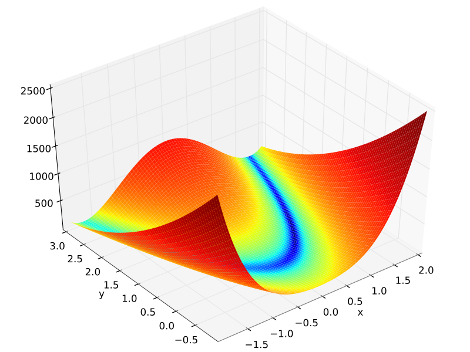

# Running ML Experiments with Hydra

In this project / tutorial, I will describe and motivate my setup for running reproducible
experiments for machine learning research. I lean heavily on [hydra](https://hydra.cc/)
for configuration because its hierarchical structure keeps research code simple as it
grows in size and complexity. With the [`experiment`
sweeper](https://github.com/martenlienen/hydra-experiment-sweeper/) hydra becomes a great
runner for parameter sweeps that are a part of model evaluation in most machine learning
research, such as comparing models with varying seeds, learning rates, parameter counts,
loss functions, etc. While hydra comes with a facility for [running
experiments](https://hydra.cc/docs/patterns/configuring_experiments) out of the box, its
standard setup is lacking in terms of reproducibility as we will see. Having reproducible
experiments is great for researchers trying to build on your work but can just as well be
a great boon during research, for example when you want to re-run an experiment from two
months ago after you just found a bug in your code. In the following, I will describe how
to set up hydra for experiments where
1. all parameters and parameter sweeps are specified via configuration files so that you
   can submit everything to version control
2. every setting can be easily configured per experiment setting, e.g. per model,
   regardless of its position in the configuration tree, i.e. training LSTM with
   `trainer.batch_size=32` but GRU with `trainer.batch_size=48` is no problem
3. configuration files are shared between experiments as much as possible to avoid
   duplication, potential inconsistencies and extra work in keeping everything in sync

---

Let's say we are currently working on a paper where we compare various optimizers and, of
course, we want to evaluate them on the well-known [Rosenbrock
function](https://www.wikiwand.com/en/Rosenbrock_function).



In particular, we want to compare how quickly the optimizers find the global minimum at
`(1, 1)` with a value of `0` as we vary the maximum number of iterations. Luckily,
`scipy.optimize` comes with a [bunch of
optimizers](https://docs.scipy.org/doc/scipy/reference/generated/scipy.optimize.minimize.html)
and an implementation of the [Rosenbrock
function](https://docs.scipy.org/doc/scipy/reference/generated/scipy.optimize.rosen.html),
so we can get going right away. Let's create a script takes an optional initial point
`x0`, an optimizer name `method.name`, optional options for the optimizer in
`method.options` and optionally a setting for the Jacobian estimation in applicable
methods in `jac`.

```python
## task.py
import hydra
import numpy as np
from scipy.optimize import minimize, rosen

from utils import save_result


@hydra.main(config_path="config", config_name="task")
def main(config):
    if config.x0 is None:
        rng = np.random.default_rng()
        x0 = rng.uniform(-1, 1, size=2)
    else:
        x0 = np.array(config.x0)

    method = config.method
    result = minimize(
        rosen, x0, method=method.name, jac=config.get("jac"), options=method.options
    )

    save_result(config, result)
    return float(result.fun)


if __name__ == "__main__":
    main()
```

Then we create a config structure in `/config` with a main config file for `task.py`
itself and three choices of optimizers, L-BFGS-B, Nelder-Mead, and TNC.

```yaml
## config/task.yaml
defaults:
  - method: ~
  - _self_

x0: ~
jac: ~
output_path: ~

## config/method/lbfgsb.yaml
name: L-BFGS-B
options:

## config/method/nelder-mead.yaml
name: Nelder-Mead
options:

## config/method/tnc.yaml
name: TNC
options:
  eta: 0.2
  stepmx: 5.0
```

For TNC we have provided some options, the other two will use all their defaults. The
values are meaningless and purely for demonstration purposes. With this setup we can run
the script with various settings such as `python task.py method=tnc
method.options.eta=0.1` or perform hyperparameter optimization with
[nevergrad](https://github.com/facebookresearch/nevergrad).

```sh
$ python task.py hydra/sweeper=nevergrad method=tnc 'method.options.eta=tag(log, interval(0.001, 1))' -m
# ...
[HYDRA] Best parameters: method=tnc method.options.eta=0.0357149680058993
```

After some more or less extensive hyperparameter optimization, we would now like to create
a plot for our paper like the following.


So we need to evaluate `task.py` for all methods and over a range of maximum number of
function evaluations. After checking the [hydra documentation for
multi-run](https://hydra.cc/docs/tutorials/basic/running_your_app/multi-run/), we come up
with the following.

```sh
python task.py 'x0=[-0.5,-0.5]' method=lbfgsb,nelder-mead,tnc 'method.options.maxfun=range(10, 151, 10)' -m
```

However, this solution has two problems. First, the sweeps are specified on the command
line. Re-running the same experiment a month from now will probably involve `grep`ing
through your `.bash_history`. The situation becomes even more difficult if one of your
co-authors adds a fourth optimizer and wants to run the experiment but just for that new
optimizer. Second, `Nelder-Mead` does not have a `maxfun` option. For this optimizer, it
is called `maxfev`. To accomodate this, we have to split our sweep into two, first just
`method=nelder-mead` with `maxfev` and then `method=lbfgsb,tnc` with `maxfun`. The
situation becomes even worse when we decide that we want to use a 2-point Jacobian
estimate with relative step size `jac=2-point` just with L-BFGS-B. Now we have three
separate commands, each with different options, that we have to remember or at least save
somewhere.

The first problem is solved easily enough with the [`experiment`
sweeper](https://github.com/martenlienen/hydra-experiment-sweeper/) that we install with
`pip install hydra-experiment-sweeper`. It lets us put the sweep overrides into an
alternative configuration file for `task.py` that we can run with `python task.py -cn
task-experiment.yaml -m`.

```yaml
## config/train-experiment.yaml
defaults:
  - override hydra/sweeper: experiment

hydra:
  sweeper:
    overrides:
      method: lbfgsb,nelder-mead,tnc
      method.options.maxfun: range(10, 151, 10)

# other settings ...
```

However, we are still facing the problem that Nelder-Mead expects a `maxfev` option
whereas the other two want `maxfun` and that we would like to associate just L-BFGS-B with
a different Jacobian estimator. Taking a step back, one could say that we don't actually
want to sweep over settings for `task.py` directly. Instead, we want to sweep over
parameterizable settings that describe one complete, coherent configuration state of
`task.py`. These parameterizable settings then say how the sweep variables are mapped to
configuration options.

Let's make that more concrete with our example. We begin by creating a whole new
configuration tree in `/experiment` and create a new `task.yaml`.

```yaml
## experiment/task.yaml
defaults:
  - _self_
  - settings: ~
  - override hydra/sweeper: experiment

hydra:
  searchpath:
    - file://config
  sweeper:
    overrides:
      settings: nelder-mead,tnc,lbfgsb
      maxfun: range(10, 151, 10)

output_path: "results/${method.name}-${maxfun}.pickle"

x0: [-0.5, -0.5]
maxfun: ~
```

This is the core of the experiment configuration. The `searchpath` setting is an important
technical detail. Here we add the original `config` directory to hydra's configuration
search path. In effect, the experiment "inherits" from the configuration in `config`. This
means that we can access the default options `config/method/tnc.yaml` without needing to
duplicate them in the `experiment` directory. In the last two lines, we set a shared
initial point `x0` for all methods and define an experiment parameter `maxfun`. Note that
this *is not* `method.options.maxfun`. With this, we come to the most important part: the
sweep overrides.

In this file we are sweeping over `settings` and `maxfun`. Settings are the aforementioned
*comprehensive configuration states* that map the sweep parameter `maxfun` to a full set
of configurations for `task.py`. Let's look at three examples.

```yaml
## experiment/settings/lbfgsb.yaml
# @package _global_

defaults:
  - /method: lbfgsb

jac: 2-point

method:
  options:
    maxfun: ${maxfun}
    eps: 1e-3

## experiment/settings/nelder-mead.yaml
# @package _global_

defaults:
  - /method: nelder-mead

method:
  options:
    maxfev: ${maxfun}

## experiment/settings/tnc.yaml
# @package _global_

defaults:
  - /method: tnc

method:
  options:
    maxfun: ${maxfun}
    eta: 0.5
```

The magic is in the `# @package _global_` declaration in the first line of each file. This
achieves that any setting in these files overwrites configuration options globally, i.e.
from the root of the configuration tree. Next, the `defaults` declarations select the
respective model for each setting. Because the `experiment` directory "inherits" from the
`config` directory, we can just reference the original `method` configuration files in
`config/method` here. Finally, each file says how the global `maxfun` option fits into its
"world view", i.e. that it goes into `method.options.maxfev` for Nelder-Mead but
`method.options.maxfun` for the other two. Additionally, we can overwrite, extend and
specialize the configuration for each method separately, such as the 2-point Jacobian estimate with `jac: 2-point` for L-BFGS-B.

Now we are ready to run the experiment.

```sh
python task.py -cp experiment -m
```

And because we recorded every option, seed, model specialty, etc. in the experiment files,
we can re-run the same experiment at any time. Yet, we can still use command line
overrides, for example to check something quickly or only run another method that we added afterwards.

```sh
python task.py -cp experiment settings=lbfgsb -m
```

You can also use the hydra overrides syntax here for quick one-off experiments.

```sh
python task.py -cp experiment settings=tnc method.options.maxCGit=1,5,10 -m
```
